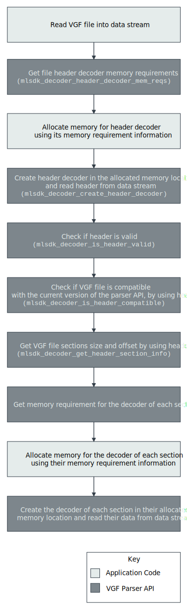
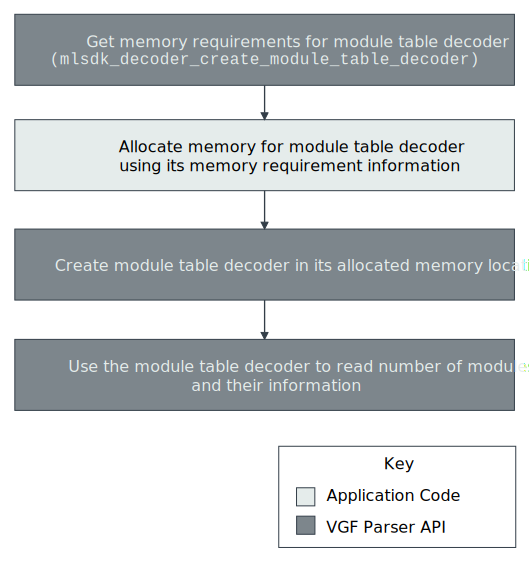
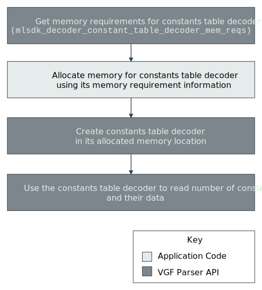

VGF Decoder C API
=================

The Decoder C API is an optional C API that reads the contents of VGF files. To decode the VGF file, the decoder C API takes the VGF file as input and drives the VGF Decoder API directly.
This API is a low-overhead thin C wrapper on C++ VGF Decoder API. The C linkage allows for higher ABI stability, and enables more options for additional language bindings and easier deployment or distribution of API updates.
Similar to the VGF C++ Decoder API, the VGF C Decoder API has some restrictions. For example, the VGF C Decoder API makes no memory allocations. You must perform the memory allocations. The API also does not make any system calls. You must perform any required system calls, for example, loading a VGF file into memory.

Similar to the VGF C++ Decoder API, the C API uses the following execution flow in order to parse a VGF file.
The VGF file has the following sections in the order specified (see enum ``mlsdk_section_name``)

  * :ref:`Modules Section`
  * :ref:`Model Sequence Section`
  * :ref:`Model Resource Section`
  * :ref:`Model Constants Section`

Each section of the VGF has its own decoder type. The memory requirement for each section decoder is retrieved by the corresponding calls, for example, function ``mlsdk_decoder_module_table_decoder_mem_reqs`` for Module section.
Each section of the VGF has its corresponding call for creating its decoder, for example, ``mlsdk_decoder_create_module_table_decoder`` function for Module section. These calls return ``nullptr`` on invalid input. Then, the created decoder reads data pertaining to that VGF section.



|

Modules Section
```````````````
``mlsdk_decoder_get_module_table_num_entries`` can use a module table decoder to retrieve the number of modules in a VGF file.
Currently, the modules are SPIR-V™ modules only.
You can use the following functions to retrieve module information through a module table decoder:

    * **Name**: ``mlsdk_decoder_get_module_name``
    * **Type**: ``mlsdk_decoder_get_module_type``
    * **SPIR-V™ entry point**: ``mlsdk_decoder_get_module_entry_point``
    * **SPIR-V™ code**: ``mlsdk_decoder_get_module_code``

There can be more than one module entry in the module section of a VGF. To retrieve the number of modules, you can call ``mlsdk_decoder_get_module_table_num_entries``.



|

Model Sequence Section
``````````````````````
Each module can have one or more segments. The segments of the module have the same type as that of the module. All segments are stored in the model sequence table. To see the number of segments, you can use ``mlsdk_decoder_get_model_sequence_table_size``.
To retrieve the information for each segment, you can use their corresponding calls:

    * **Name**: ``mlsdk_decoder_model_sequence_get_segment_name``
    * **Type**: ``mlsdk_decoder_model_sequence_get_segment_type``
    * **Input binding slot**: ``mlsdk_decoder_model_sequence_get_segment_input_binding_slot``
    * **Output binding slot**: ``mlsdk_decoder_model_sequence_get_segment_output_binding_slot``
    * **Descriptor binding slot**: ``mlsdk_decoder_model_sequence_get_segment_descriptor_binding_slot``
    * **DescriptorSet info size**: ``mlsdk_decoder_model_sequence_get_segment_descriptorset_info_size``
    * **Constant indexes**: ``mlsdk_decoder_model_sequence_get_segment_constant_indexes``
    * **Dispatch shape**: ``mlsdk_decoder_model_sequence_get_segment_dispatch_shape``


The binding slot acts as a bridge between information on the resources used by a segment, and the resources. The resources are stored in the Model Resource Table (MRT). You can identify each resource using its MRT index.
The following components of a segment have information (including MRT index) of their corresponding resource in the MRT. You can read the resources to a binding slot memory location allocated with the corresponding calls:

    * **Segment inputs**: ``mlsdk_decoder_model_sequence_get_segment_input_binding_slot``
    * **Segment outputs**: ``mlsdk_decoder_model_sequence_get_segment_output_binding_slot``
    * **Segment descriptors**: ``mlsdk_decoder_model_sequence_get_segment_descriptor_binding_slot``

 You can use the binding slot to read:

    * Number of bindings of a binding slot of a segment component (inputs, outputs, descriptors): ``mlsdk_decoder_binding_slot_size``
    * Binding ids of entries in the binding slot: ``mlsdk_decoder_binding_slot_binding_id``
    * MRT indexes of entries in the binding slot: ``mlsdk_decoder_binding_slot_mrt_index``

.. figure:: assets/c_decoder_model_sequence_section.svg
   :align: center
   :width: 85%

|

Model Resource Section
``````````````````````
This section describes the Model Resource Table (MRT). The MRT contains all the Model Resource entries of the VGF file. To find resources through their unique MRT index, you can use the MRT as a lookup table from the other sections of the VGF.

Model Constants Section
```````````````````````
The model constants section is the largest section of a VGF file, which contains VGF constants information.

.. caution::
   The data in the constant section is stored in raw bytes, there are no endianness checks. The target host and the host where you create the VGF must use the same endianness.

To retrieve the number of constants in a VGF file, using a constants table decoder, you can use ``mlsdk_decoder_get_constant_table_num_entries``.
To retrieve constant information through a module table decoder, you can use the following functions:

    * **MRT index**: ``mlsdk_decoder_get_constant_table_mrt_index``
    * **Data**: ``mlsdk_decoder_get_constant_table_data``



|
|

C Decoder API Reference
-----------------------

.. doxygengroup:: VGFCAPI
    :project: MLSDK
    :content-only:
